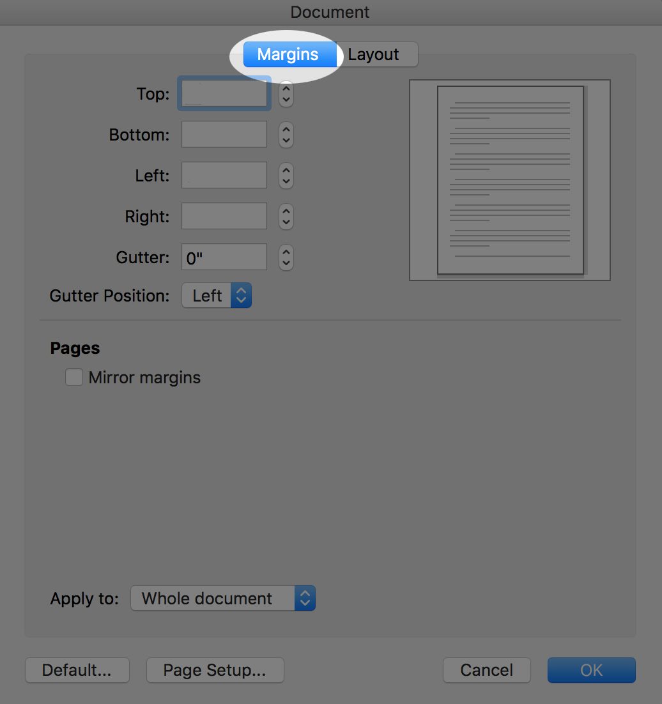

# Documents Task 03 Part 1: Set Up Skills

## Macintosh Version

_If you use Safari as your go-to browser, you may not be able to save the .txt file to your desktop. Use Firefox or Chrome for this tutorial._

### [Go to Project Gutenberg and find your assigned book](http://www.gutenberg.org/wiki/Main_Page)

This tutorial uses the example Book: *Heroines every Child Should Know*

**DO NOT USE THIS BOOK FOR YOUR PROJECT THAT YOU SUBMIT!**

This is the main page for *Heroines Every Child Should Know*: <http://www.gutenberg.org/ebooks/35994>


### Click on Plain text UTF-8 for the plain text file and save page as text file ```BookName.txt``` This Should save it to your desktop.


###  Open up Microsoft Word, Choose Blank Document and then Choose File Open to open the .txt file. Accept the default utf-8 encoding and click OK.

You may see a different screen than the one below. If so, accept the default first, then you should then see the one below.


### Turn on "show all non-printing characters"


Now you can see your paragraph markers:


### 3.01: Delete all of the starting text up the the Title.


#### Delete the contents also, or you can come back later to delete them (you may want keep contents for reference until after you have styled your chapter headings; it may prove helpful for you as your search for your headings).


 Your new table of contents will be automatically generated from your headings, so the existing table of contents must go now or later.

### 3.02: Delete all of the ending text you do not need.


#### 3.03: On main menu choose ```Edit``` > ```Find``` > ```Advanced Find and Replace```:


#### b. Click the ```Replace``` button and go to bottom where it say Find, then choose ```Special```, then click ```Paragraph Mark``` to put the paragraph mark in the find box.


#### c. Now you can go to the [slide show](https://ils.unc.edu/courses/2017_fall/inls161_001/document-markup/exercise-one/exercise-one-slides/index.html#/) and complete the search and replace tasks.

<a href="https://ils.unc.edu/courses/2018_fall/inls161_001/03-01d-documents-exercise-1-slides.html"> </a>

### 3.04 and 3.05: Page Setup

Click the ```Layout``` tab ```Margins``` button and then ```Custom Margins...```


#### b. This gives access to Document Margins and Document Layout settings.

Document Margins > Margins Panel:



Document Layout:


#### c. You can also access your page size here if you can't get the size you need from the size button on the Layout Panel:


[Go to Part 2](../docs-mac-project-part-2/README.md)

