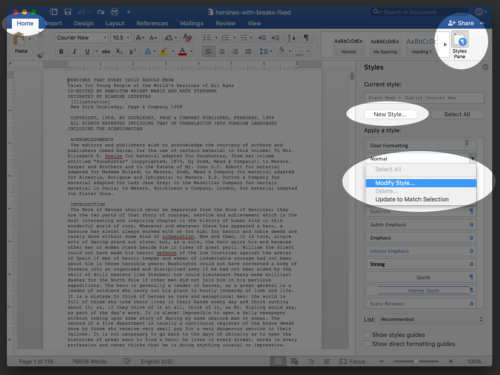
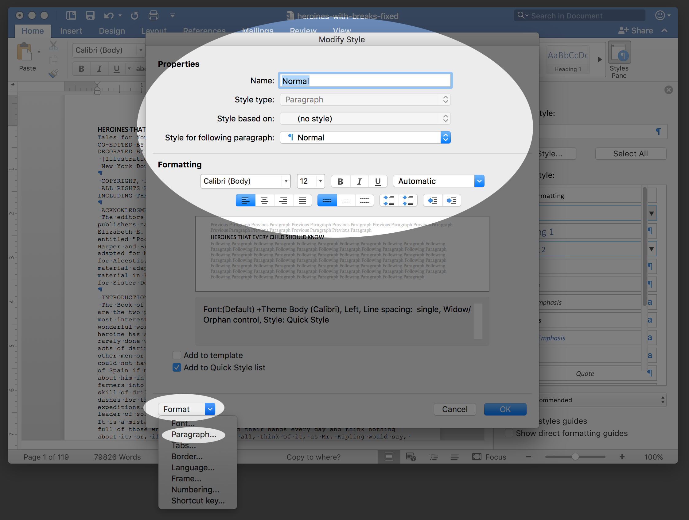
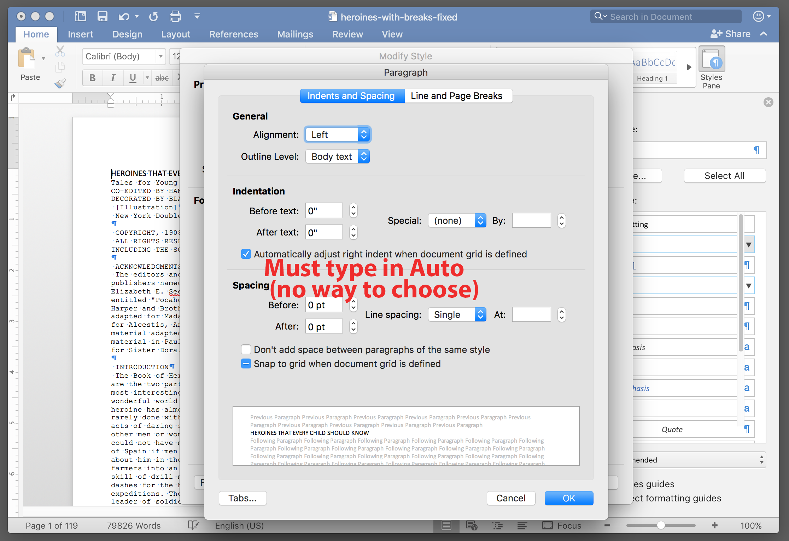

# Documents Task 03 Part 2: Style Control Skills

## Macintosh Version

### 1. Screen shots so you can create All Your Styles

Start with the Home tab<!----> and open the ```Styles Pane``` and then choose ```New Style``` for your ```Task03Content``` Style. If you choose the modify normal, then you will not be able to name the style as you wish. After the new style is created, you can modify it later, if necessary, by clicking on the Style and then choosing ```Modify Style...```




### 2. ```Click Modify Style...``` to show the Modify Style Panel



To make more style changes, click ```Format``` and ```Paragraph``` (just above)


### 3. This allows you to make the rest of your Style Changes



[Go to next page](../docs-mac-project-part-3/README.md)

