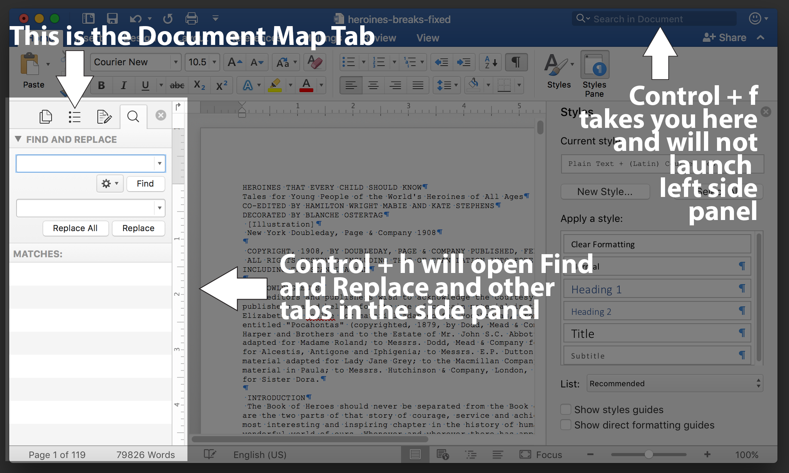

# Documents Task 03 Part 2: Style Control Skills

## Macintosh Version

### 3.06: Screen examples so you can create All Your Styles

Start with the Home tab and open the ```Styles Pane``` and then choose ```New Style``` for your ```Task03Content``` Style. If you choose the modify normal, then you will not be able to name the style as you wish. After the new style is created, you can modify it later, if necessary, by clicking on the Style and then choosing ```Modify Style...```


#### b. ```Click Modify Style...``` to show the Modify Style Panel


To make more style changes, click ```Format``` and ```Paragraph``` (just above)


#### c. This allows you to make the rest of your Style Changes

Correction: There is not a drop down to choose auto, but you can click the arrows until you get to auto. Or you can type it in as directed in the screen shot.


### 3.07: After you create your Task03Content Style, select all of the text, and convert it to this style.

### 3.08.01: Follow the grade sheet info or the task page to create Task03Footnotes

### 3.08.02: Insert and format your footnotes, if you have any.

If you don't, you still need to create the new style and insert a footnote that includes the words "an example of the new footnote style" somewhere in the document. Go to the References pane and place your cursor somewhere in the Task03Content text and  click the insert a footnote button. Don't try to put a footnote in a footer. Footers are not for footnotes; this is a common misconception.

### 3.09 and 3.10: Modify Title Style and Subtitle Style

Modify the Title style to 16 point sans serif font of your choosing, black color, center alignment . 
Modify the Subtitle style to serif font of your choosing, black color, center alignment. 
(if you want to have your title or subtitle in a color other than black, you may do so, but tell me about it in a footnote.)

### 3.11: Format existing Title and Subtitle Style

"On the first page of the document, format the words in the title in the Title style. 
If there is a subtitle, format it in the Subtitle style."

### 3.12. To Apply all your Heading 2 styles (and Heading 1 if you have Numbers and Titles) you will need your document map to show. 

Format the name of each section that precedes the chapters of the document (such as Preface, Forward, etc. if the work has any) and the title of each chapter in Heading 2 style (these will be used later for the real table of contents). 

If you have any text sections that follow the chapters, format them in the same Heading 2 style.  You will have multiple sections and chapter titles to format appropriately. You can productively use your CNTL+F tool here. 

If your work also has chapter numbers, format each chapter number in Heading 1 style. 

If your work has no chapter titles, format the chapter number in the Heading 2 style.

But be sure to use only one heading style per line of text.

The quickest way to get the document map up: Put your cursor in the first page and press ```control``` + ```H```. This will launch the left side panel which will let you click the document map tab:



[Go to Part 3 & 4](../docs-mac-project-part-3-4/README.md)
