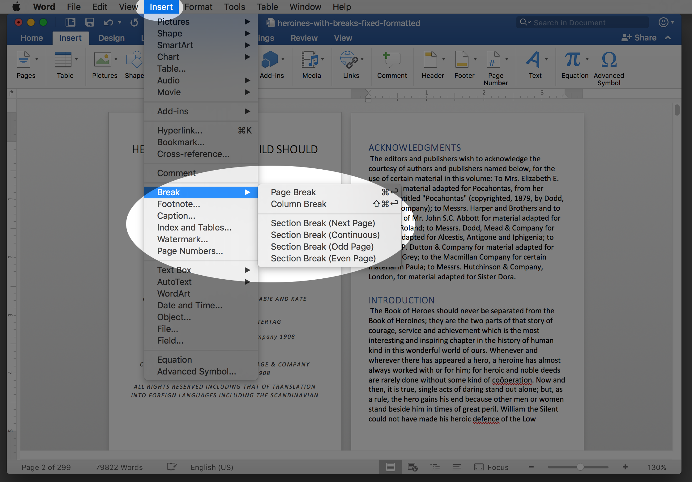
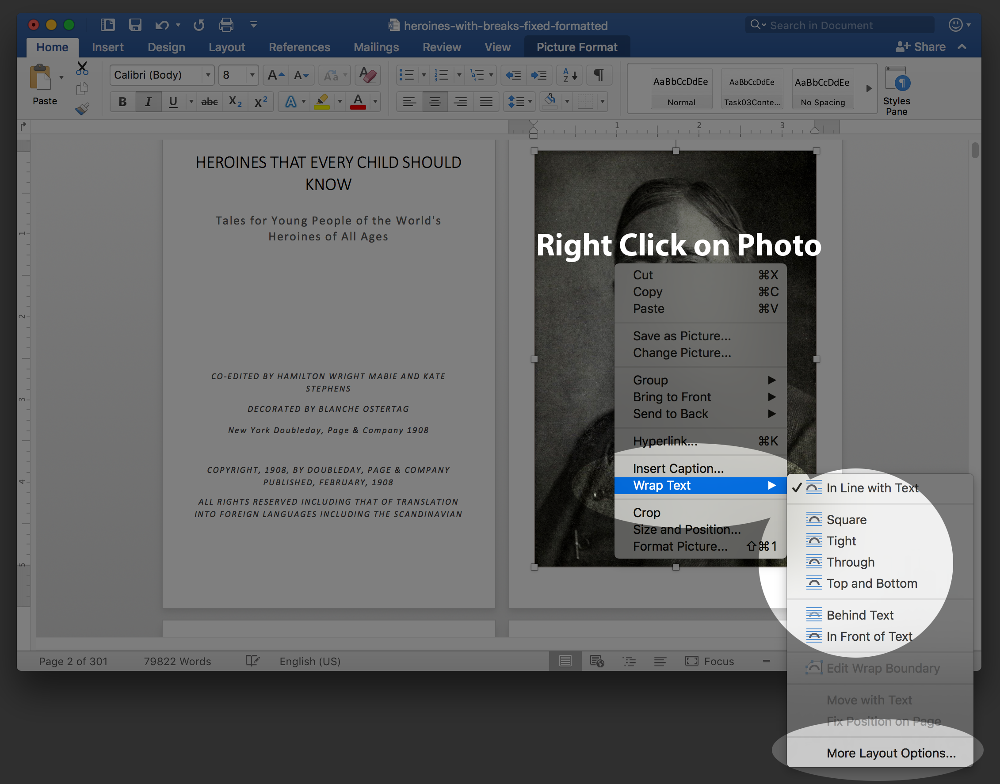
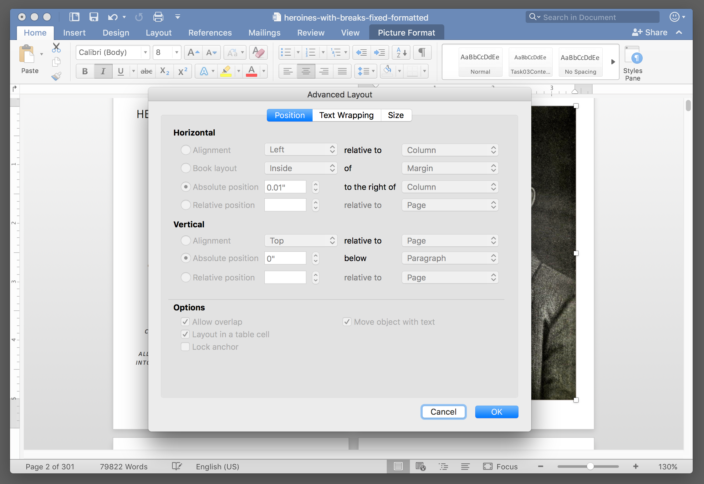
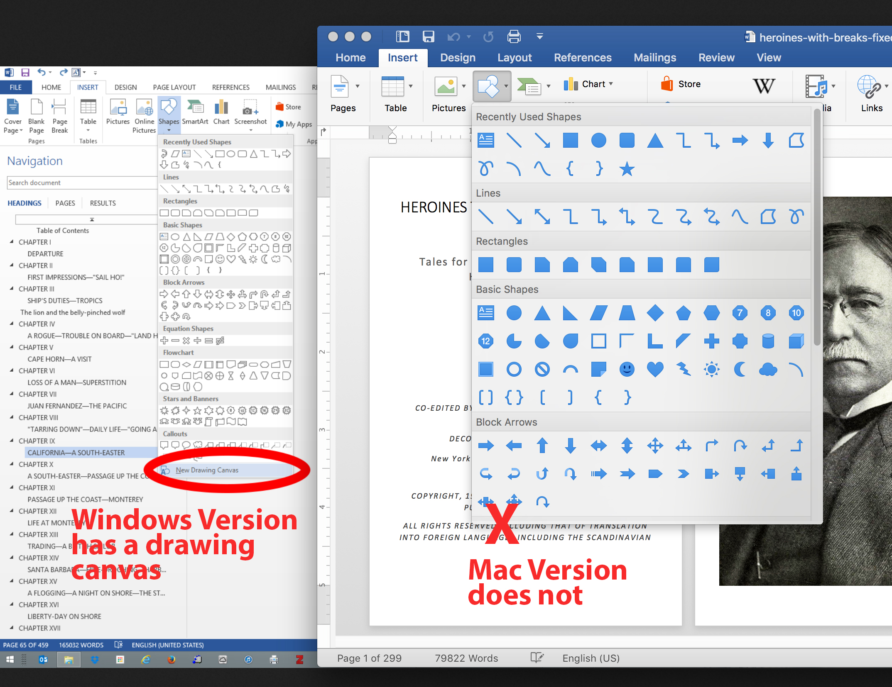

# Documents Task 03 Part 3 & 4: Sectioning And Image Tool Skills

## Macintosh Version

### 1. To choose from a list of different section breaks, you can use the menu even if you are not on the layout tab.(You can click the breaks button on the layout tab if you prefer.) Which type of section break should you use?



### 2. Image Wrap and Layout Options

After you place your author image, you can right click on the photo and access the page wrap setting. To get to all of the layout settings, click ```More Layout Options...``` at the bottom of the fly-out panel. 




### 3. Clicking The More Layout Options will open the Advanced Layout  panel giving you access to ```position```, ```Text Wrapping``` and ```Size``` options.

Use this for setting the position and alignment for your author image and your logo image.




### 4. Mac Version of Word does not have a Drawing Canvas

The Windows Version requires the drawing canvas to group an imported image and a Word generated shape.




### 4. How to group an image and a shape in MS Word on the Mac without a Drawing Canvas:


I don't expect you to do this. It's ridiculous. Just make a logo out of shapes. But if you want to group your shapes with an image, I got this to work:

Click into the text and insert a picture. Set the wrapping behind text so that the text will flow over the photo, otherwise a shape will not stay on top of the image. Then return a lot of blank lines so that the text will move off of the top of the Image. Now get your shape and put it on top of the image. Don't try to group it now, because if you do, your shape will disappear behind the back of the image. (Even though the shape looks like it's on top, _it's not really???_ hmmm.) So bring it to the front. Now you can group it. Drag your image back where you want it, and  set the wrap the way you want it and then delete all the hard returns you put in.

[Go to Part 5](../docs-mac-project-part-5/README.md)

