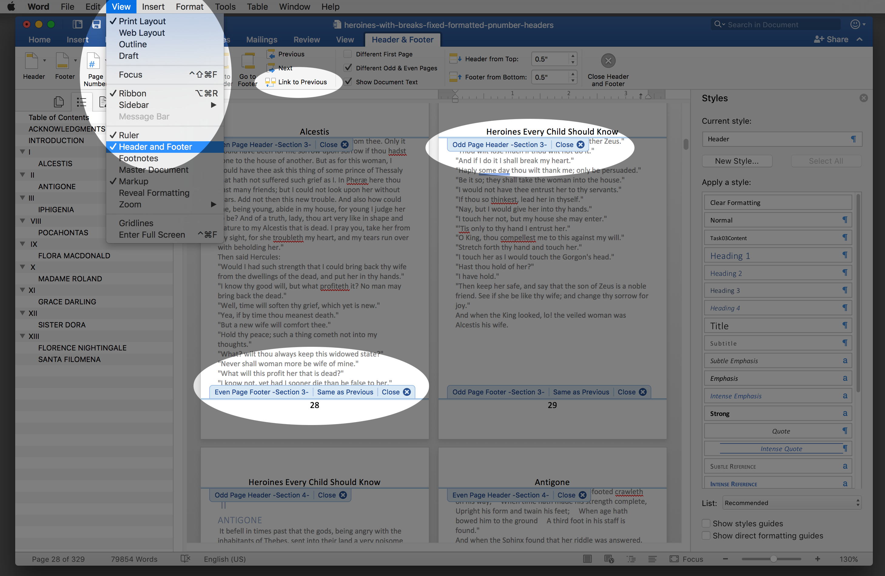
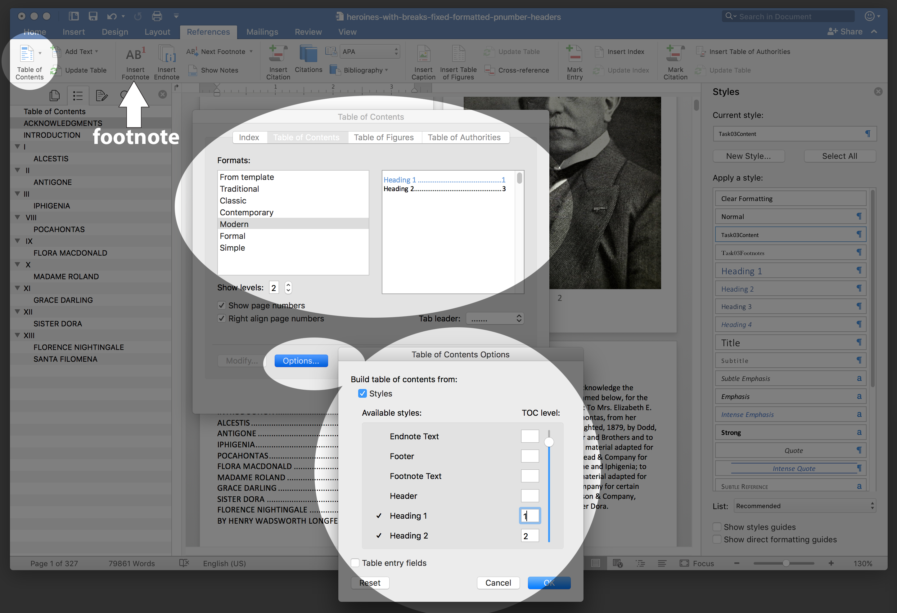

# Documents Task 03 Part 5: Header and Reference Tools Skills
## Macintosh Version

### 3.20, 3.21, and 3.22: Choose View from the Menu and then choose Header and Footer. You will then see the Header & Footer Tab 

You can work with Page Numbers here and also get access to ```Link to Previous```, which is very important for Changing the header name for each Chapter Name with section breaks.

Use the Page Number tool to put page numbers in the footer. Don't try to edit the footer.



### 3.23: Table of Contents 

Here is all you need to take care of the table of contents tasks and the footnote task:


### Footnote

If you forgot to put in a footnote, you can get that done here now.

### 3.24: Save and Store

Place the completed task in your password protected directory and place a hyperlink to that file on your task 03 link on your INLS class page on your website. Name your document ```03-lastname.firstname.docx```
